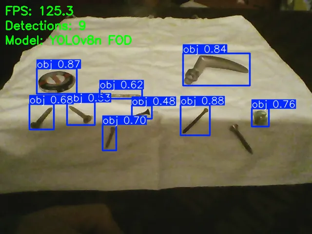

# FOD Detection 

Real-time foreign object debris (FOD) detection using a fine-tuned YOLOv8n model.


*one of the screws is.. screwing me over...*

---

## Disclaimer

This is a personal learning project built on a laptop over a few days. It was trained on a public dataset used in academic research, tested through a webcam pointed at objects on a desk, and is not validated for any real-world safety use.

The goal was to get hands-on with PyTorch, object detection pipelines, and the ONNX export workflow relevant to embedded/SoC deployment — not to build a production system. Do not use this to detect FOD on an actual runway, OBVIOUSLY!

---

## What is FOD?

Foreign Object Debris — nuts, bolts, metal fragments, anything that ends up on an airport runway and shouldn't be there. A single bolt can destroy a jet engine on takeoff.
FOD-related damage costs the aviation industry over $4 billion annually.
This project trains a model to detect it automatically from camera footage.

---

## Context & Prior Work

This project was informed by research on the FOD detection problem in the CV/ML space.
The most relevant reference is the FOD-A dataset paper:

> Munyer, T., Huang, P-C., Huang, C., & Zhong, X. (2021).
> *FOD-A: A Dataset for Foreign Object Debris in Airports.*
> arXiv:2110.03072. https://arxiv.org/abs/2110.03072

Published research using YOLOv8 variants on airport FOD datasets reports mAP@0.5 values in the range of 0.911–0.939.

---

## Results

| Metric | Value |
|--------|-------|
| Model | YOLOv8n (fine-tuned) |
| Dataset | FOD-i2kfx — airport runway imagery |
| Precision | 95.5% |
| Recall | 88.8% |
| mAP@0.5 | 92.8% |
| mAP@0.5-0.95 | 61.8% |
| GPU inference | 6.3ms/image (~150 FPS) |
| CPU inference | 39.6ms/image (~25 FPS) |
| Training time | 38 min on RTX 2050 4GB |
| ONNX export | 12.3MB |

Training ran for 50 epochs on a laptop GPU. The model is a YOLOv8n fine-tuned on domain-specific data. The mAP@0.5 of 92.8% sits in line with modified YOLOv8 variants published in research on this exact problem.

---

## Stack

- Python 3.10
- PyTorch 2.6 + CUDA 12.4
- Ultralytics YOLOv8
- OpenCV
- ONNX Runtime

---

## Setup
```bash
git clone https://github.com/ApparentlyVenus/cv-fod-detection
cd cv-fod-detection

python3 -m venv cv-env
source cv-env/bin/activate
pip install -r requirements.txt
```

Download the dataset from [Roboflow](https://universe.roboflow.com/foreignobjectaerodromes/fod-i2kfx), export in YOLOv8 format, and place it in a `dataset/` folder at the project root.

---

## Usage

**Train:**
```bash
python3 train.py
```

**Run inference on test set:**
```bash
python3 inference.py
```

**Export to ONNX + Benchmark against PyTorch:**
```bash
python3 export.py
```

**Live webcam detection:**
```bash
python3 webcam.py
```
Press `Q` to quit.

---

## Deployment

The trained model exports to a 12.3MB ONNX file, loadable by ONNX Runtime on any platform. The same file can be compiled for deployment on embedded SoC hardware without any changes to the model itself.

Compilation to specific hardware targets was not tested (no hardware available),
but the export step and CPU runtime were validated.

---

## Dataset

[FOD-i2kfx on Roboflow Universe](https://universe.roboflow.com/foreignobjectaerodromes/fod-i2kfx)
— Not included in this repo.

---